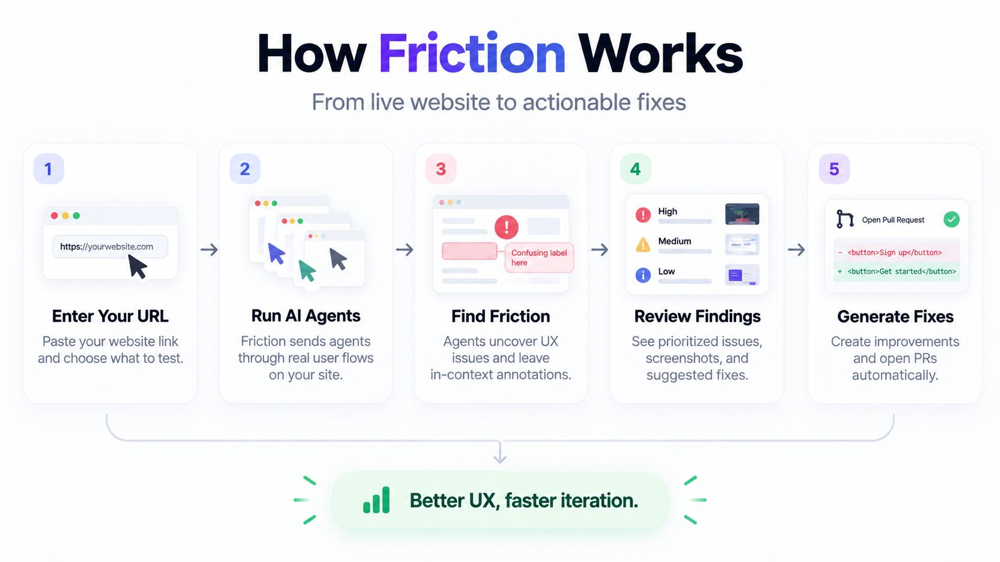
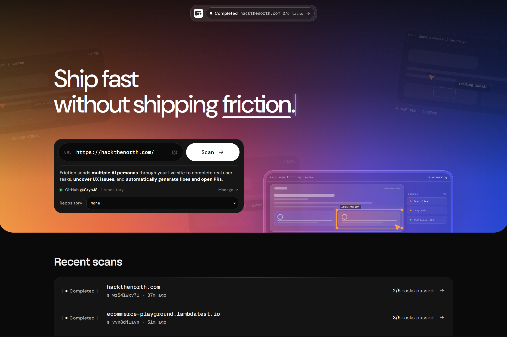
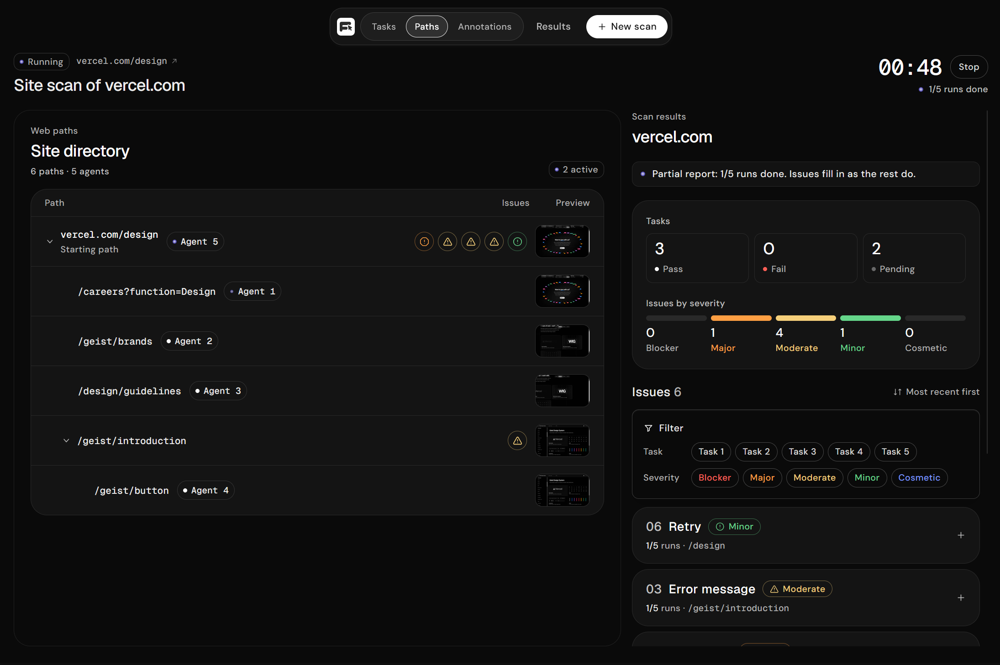
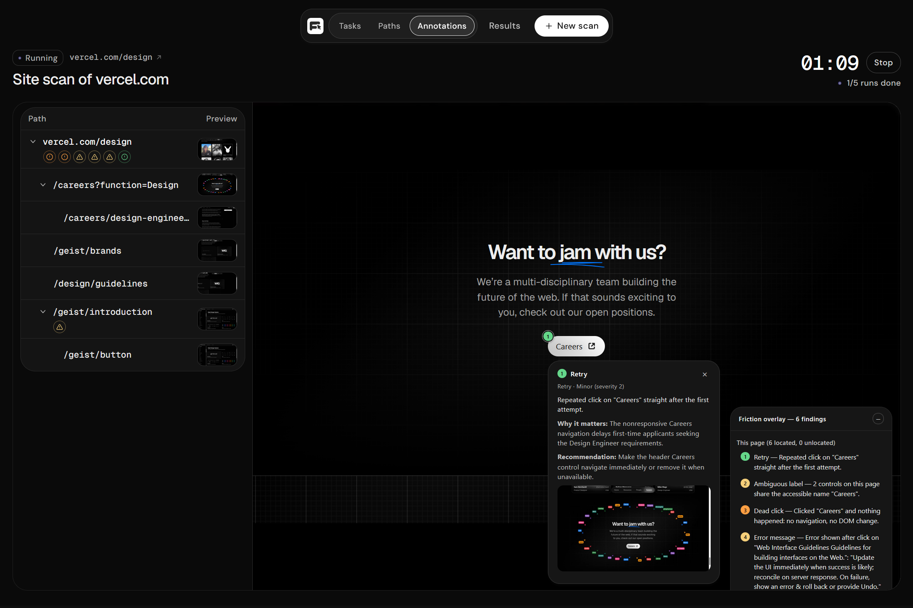
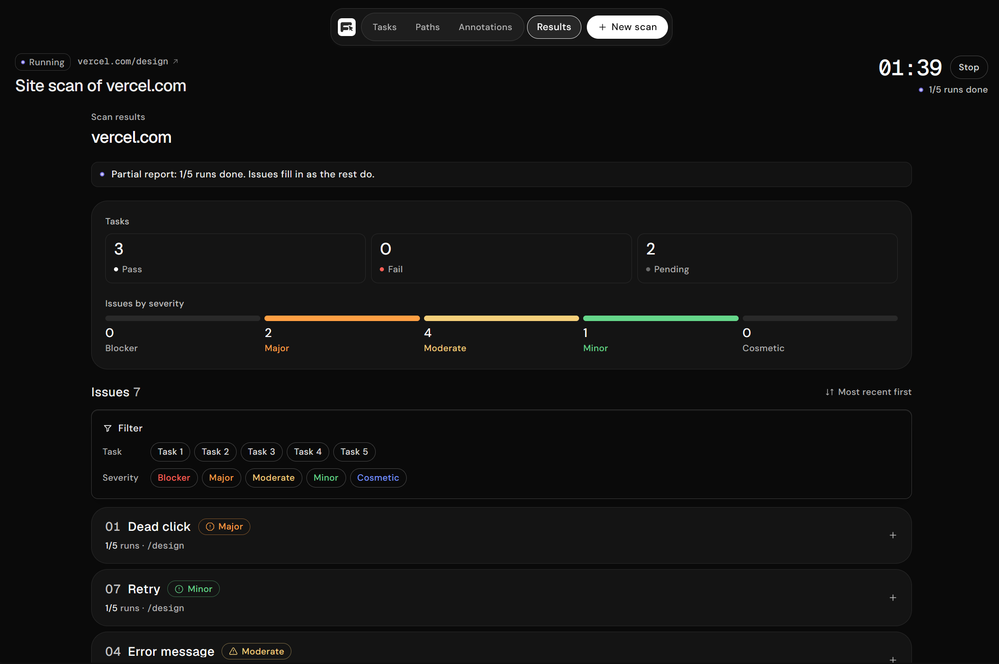
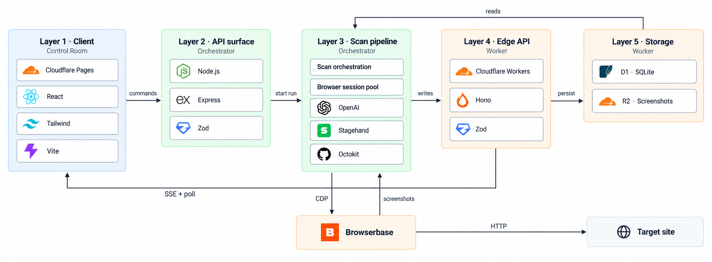

# Friction

### Autonomous QA that finds the flaw, proves the fix, and opens the PR.

Programmers have automated product development, so what's next?
Product testing.

Friction gives an AI agent a website and asks it to complete the tasks that matter most to a first time visitor. The agent uses a real browser, records what happened, and turns the evidence into a severity ranked report. Then, Friction proposes a small fix, installs it in a fresh browser session, and reruns the exact same task to verify whether the experience actually improved.

If the fix is verified and can be mapped back to the source, Friction can open a draft GitHub pull request with a regression test.

Built for [Hack the North 2026](https://devpost.com/software/friction-z0xgf6).

## Watch the demo

[Watch Friction on YouTube →](https://www.youtube.com/watch?v=8UGiKTf0RAI)


## Why it stands out

- **Tests like a visitor.** One agent navigates a live site and attempts realistic, high value tasks instead of checking isolated selectors.
- **Findings come with evidence.** Each issue includes the observed interaction, screenshot evidence, severity, confidence, and how many tasks encountered it.
- **Fixes are experimentally verified.** A proposed patch is installed before first paint in a brand new browser context, then the same task is replayed.
- **The report is site wide.** Findings from multiple tasks are deduplicated and ranked so repeated friction rises to the top.
- **The loop can reach the codebase.** Verified fixes can be mapped to source, covered by a generated Playwright regression test, and opened as draft PRs.
- **The demo works without credentials.** Mock mode replays a deterministic golden run through the real pipeline, including fix verification.

## How it works



The control room shows the scan as a live task tree and streams run events as they happen. The report brings each fix together with a **Before / After** comparison and the evidence behind the verdict.

## Product demo

1. Start the app in [mock mode](SETUP.md#quick-start).
2. Open the control room and click **Replay the golden run**, or enter a URL and choose **Scan & test**.
3. Select a task to watch the agent work through the browser.
4. Open the report to see ranked findings, screenshots, and fix verification.

For the full live browser setup, environment variables, deployment notes, and demo runbook, see **[SETUP.md](SETUP.md)**. Start from **[.env.example](.env.example)** when enabling live runs.

## Screenshots

<table>
  <tr>
    <td></td>
    <td></td>
  </tr>
  <tr>
    <td></td>
    <td></td>
  </tr>
</table>

## Architecture



The monorepo is split into three deployable pieces:

| Package | Responsibility |
| --- | --- |
| `apps/control-room` | Vite + React interface for scans, live runs, evidence, and reports |
| `apps/orchestrator` | Browser sessions, agent loop, friction detection, fix verification, and GitHub integration |
| `apps/worker` | Hono API, Cloudflare D1 persistence, R2 evidence storage, and server sent events |
| `packages/shared` | Shared contracts, detectors, verification rules, report assembly, and demo fixture |

## Tech stack

`TypeScript` · `React` · `Vite` · `Node.js` · `OpenAI Responses API` · `Browserbase` · `Stagehand` · `Cloudflare Workers` · `D1` · `R2` · `GitHub REST API` · `Playwright`

## Development

```bash
pnpm install
pnpm dev
```

Then open `http://localhost:5173`. The default setup is credential free and uses the deterministic golden run. Run the checks with:

```bash
pnpm typecheck
pnpm test
```

More commands and the live configuration path are documented in **[SETUP.md](SETUP.md)**.

## License

See [LICENSE](LICENSE).
